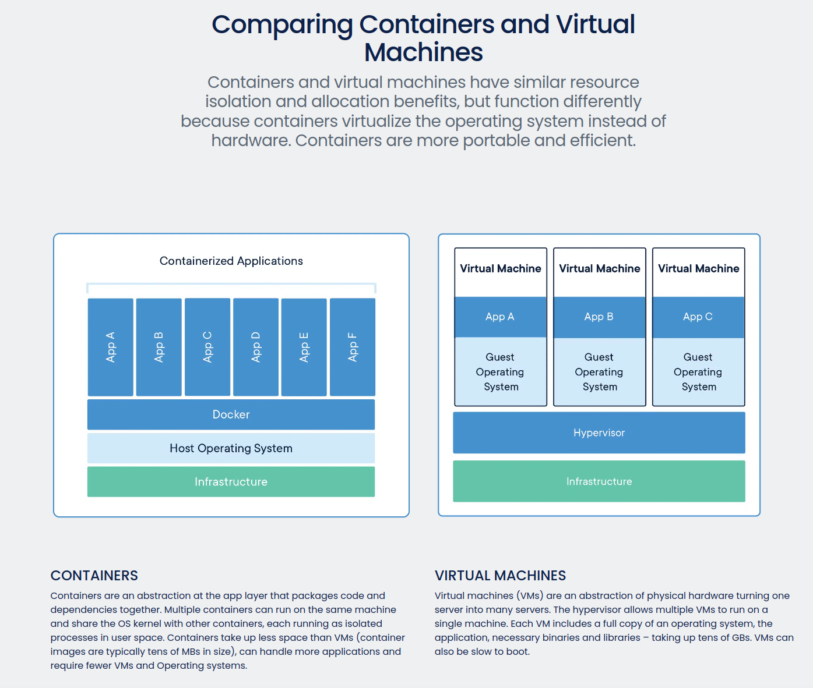

# Introduction to developing with Docker and VS Code

This repo provides the base ROS2 packages needed to develop on the LIMO. Currently, there are no LTS distributions of ROS2 available for Ubuntu 18.04 which is the base OS for the Jetson Nano.

Hence, we introduce the use of Docker to provide a Ubuntu 22.04 environment to develop with ROS2 Humble.

## [Why Docker](https://docs.docker.com/get-started/overview/)

Docker provides OS-level virtualisation, allowing for the deployment of software packages in isolated environments called containers. 

*Images are prepacked beforehand and become containers when run on Docker Engine*

## Docker vs virtual machines

Docker and virtual machines provide similar benefits, however, they are functionally different. 

## Visual Studio Code Setup on Local PC

### References
* [VS Code Remote Development](https://code.visualstudio.com/docs/remote/remote-overview)
* [Template](https://github.com/athackst/vscode_ros2_workspace)

### [Extensions](https://code.visualstudio.com/docs/editor/extension-marketplace)
* Remote Development

### Connect to LIMO and start container

1. SSH into the LIMO using VS Code
    * In VS Code, Ctrl + Shift + P to bring up the command pallete
    * (Do once if static IP assigned) Search for "Remote-SSH: Add new SSH Host..."
    * ssh agilex@<limo_IP>
    * Bring up command pallete again, search for "Remote-SSH: Connect to Host..."
    * Once connected, "File" -> "Open Folder" and navigate to limo_ros2 workspace

2. Run docker image
    * Once in the workspace, VS Code should detect the Dockerfile and ask to build container
    * Alternatively, Ctrl + Shift + P to bring up the command pallete and search for Remote-Containers: Rebuild Container